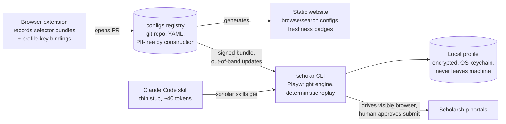

# ScholarAssist: Full Plan

One profile, honestly maintained by the student, mapped onto many incompatible scholarship portals by a config-driven agent, with a human approving every submission. CLI + Claude Code skill for execution, a public git registry of per-site configs for shared knowledge, a generated website for discovery, and a browser extension for creating configs.

Plan date: 2026-08-12. Built from four parallel deep-research reports (market, technology, sharing ecosystems, risks). Sources at the end.

---

## 1. What the research changed about the original idea

The original idea survives almost intact on architecture and dies in one place on strategy.

| Original idea | Verdict | Why |
|---|---|---|
| CLI + skill, not MCP | **Confirmed, strongly** | MCP charges 550-1,400 tokens per tool definition every session (Chrome DevTools MCP: ~18k tokens idle). A skill stub costs ~40 tokens until invoked. A 40-step replay is one Bash call, not 40 tool round-trips. Anthropic's own numbers: 150k → 2k tokens moving from tool calls to code execution |
| Per-site configs for token efficiency | **Confirmed, and it is the moat** | The whole field converged on cached trajectories in 2025-26 (Stagehand cache, Skyvern code caching, browser-use workflow-use) but every implementation is private and machine-generated. Nobody ships a human-readable, community-maintained registry. Research backs sharing: SkillWeaver showed configs authored by a strong agent lift weak agents up to 54.3%; Agent Workflow Memory: +51.1% on WebArena |
| Website platform to share configs | **Confirmed, but repo-first** | Every surviving ecosystem (Homebrew, Obsidian, Karabiner, yt-dlp, uBlock) is a git repo as source of truth with a generated read-only site on top. Hosted registries with upload endpoints (userscripts.org) died of their moderation queues |
| Extension to create configs | **Confirmed, with one twist** | No existing recorder captures field *semantics*. The extension must discard typed values and record only selector-bundle + profile-key bindings. That twist is simultaneously the privacy story and the differentiator |
| Auto-apply at volume | **Rejected by the evidence** | Best published agent success on WRITE tasks (forms, submissions) is 46.6%. The scholarship community has already concluded bulk-apply is a lottery trap (185-upvote canon post). Sites explicitly disqualify bot entries (Bold.org, ScholarshipOwl). The job-market ran this experiment: LazyApply (auto-submit) sits at 2.4/5; Simplify (autofill + human submit) at 4.9/5 with 1M+ installs |

**The pivot:** ScholarAssist is not a volume tool. It helps a student apply to 12 well-matched, high-value scholarships excellently instead of 300 badly. The tool removes tedium from a process the student still performs, reviews, and owns.

---

## 2. Why now (market findings)

- **The market's best products are dead or captured.** Going Merry (best-regarded one-profile-many-applications product) was shut down by its lender owner in March 2026 with no successor. Scholly was absorbed by Sallie Mae; its founder is now suing over alleged sale of student data. There is no incumbent AI scholarship tool with community mindshare.
- **The business model of the incumbents is the enemy of the user.** Fastweb, Scholarships.com, Cappex, ScholarshipOwl and others were named in the Hechinger investigation for selling student records to colleges and marketers, up to hundreds of dollars per record. ScholarshipOwl's Trustpilot is a wall of billing dark-pattern complaints.
- **Open source is the literal inverse of every documented grievance.** No subscription (kills dark patterns). Local-first data (kills data selling, currently in litigation). Inspectable configs (kills scam-listing doubt). Portable files (kills platform mortality, which has orphaned students three times in four years).
- **The strongest structural fit is international.** Erasmus Mundus: 200+ programmes, each with its own portal, form, word counts, document set, and deadline; no central portal. Chevening: four 500-word essays plus a 2,800-hour structured work-history table. DAAD splits scholarship and university applications. South Asia/Bangladesh has no local platform at all; students use Facebook groups and SEO blogs, and nationality-eligibility filtering is an unmet need nobody serves.
- **The empirically winning strategy needs a helper, not a blaster.** Winners consistently report the same thing: niche, local, essay-heavy awards with few applicants. Effort filters competition. The unsolved mechanical problem is one canonical profile + one essay library, mapped onto N heterogeneous portals without retyping 40 fields, missing a document, or blowing a timezone deadline.

---

## 3. Positioning

**Target segments, in order:**
1. International flagship applicants (Erasmus Mundus, Chevening, DAAD, Commonwealth, GKS, Australia Awards). Few applications, life-changing value, maximum per-portal fragmentation. Config value is highest here.
2. Platform-first coverage of scholarship management systems: Blackbaud Award Management/AcademicWorks, AwardSpring, SmarterSelect, Submittable, Kaleidoscope, AwardForce. One platform config covers thousands of tenant sites (the Simplify-targets-ATS insight).
3. US micro-scholarships last, selectively, and only sites whose terms permit it.

**What ScholarAssist is not:**
- Not an essay writer. Fulbright and Rhodes ban generative AI outright; Bold.org disqualifies on detector suspicion; detectors disagree by 40+ points on the same honest text. The tool transports the student's own writing (word-count fitting, prompt-coverage flagging), never composes it.
- Not an auto-submitter. Human review gate before every submission, always, no flag to disable it.
- Not a CAPTCHA bypasser, fingerprint spoofer, or proxy rotator. Challenge detected → pause and hand the visible browser to the human.
- Not a sweepstakes blaster. No bulk mode, no multi-account, cycle-aware dedupe.

---

## 4. System overview

Five components, four repos:



| Component | Repo | Stack |
|---|---|---|
| `scholar` CLI + skill stub | `scholarassist/scholar` | TypeScript, pnpm, Playwright, ArkType schema |
| Config registry | `scholarassist/configs` | YAML + JSON Schema, CI lint, cosign signing |
| Website | generated from configs repo | Static (Astro), GitHub Pages/Vercel, no server, no accounts |
| Extension | `scholarassist/recorder` | MV3 WebExtension (WXT), Chrome first, Firefox shim later |
| Profile | user's machine only | Encrypted at rest, key in OS keychain |

---

## 5. The config format (the product's core)

One YAML file per site, keyed by domain, strictly declarative, zero user data. Schema versioned, validated in CI at merge and again in the client at load.

```yaml
schema_version: 1
site:
  id: chevening
  match: ["https://apply.chevening.org/**"]
  maintainer: "@someone"
  last_verified: 2026-08-01

capabilities: [search, detail, apply]
requires: [login]                # login | file-upload | payment; undeclared use = hard runtime failure
risk:
  captcha: turnstile             # declared honestly, RSS-Bridge style
  submit_policy: human_confirm_required   # invariant; not configurable

fields:                          # canonical profile key -> how this site asks for it
  applicant.given_name:
    autocomplete: given-name     # HTML spec token where one exists
    locator: { role: textbox, name: "First name" }
  essay.leadership:
    locator: { role: textbox, name: "Leadership and influence" }
    kind: freeform               # transport from essay library; never generate
    max_chars: 3000              # ~500 words

flows:
  apply:
    steps:
      - id: open_form
        action: click            # closed vocabulary: navigate|click|fill|select|press|scroll|upload|extract|wait
        target:
          primary:   { role: link, name: "Start application" }   # semantic first
          fallbacks: [ { label: "Apply" }, { css: "a.apply-btn" } ]  # ranked, CSS last
        wait_for: { role: heading, name: "Application" }
      - id: fill_identity
        action: fill_fields
        fields: [applicant.given_name, applicant.family_name, applicant.email]
      - id: dynamic_questions
        action: agent            # explicit LLM escape hatch, first-class, never cached
        task: "Answer remaining required questions from the profile. Never invent facts; report unknowns."
      - id: review
        action: halt
        reason: human_confirm_required
```

Design rules, each traceable to prior art:
- **Values never appear in configs.** Field entries name profile keys; there is no syntactic slot for a GPA or address. Config purity is enforced by construction, then by lint (structural-pattern allowlist for all free text), then by Presidio + gitleaks in pre-commit and required CI, then by canary tokens seeded in local profiles.
- **Multi-strategy targeting**: `primary` + ranked `fallbacks[]` (Chrome DevTools Recorder `selectors[]`, Selenium IDE `targets[]`), semantic-first per workflow-use. Durability ladder: role+accessible-name > label text > autocomplete token > testid > CSS/XPath.
- **Origin lock**: allowed origins derive from the config's file path (domain-keyed layout), enforced by the runtime, not read from the file body. Kills exfiltration-by-redirect and typosquatting in one move.
- **`action: agent` is a first-class step** (workflow-use's AgentTaskWorkflowStep): some steps are inherently non-deterministic and should say so.
- **`fields` map is separate from flows**: the mapping is the reusable asset; one profile-vocabulary edit propagates everywhere.
- **WebMCP-shaped**: flows are named actions with typed inputs, so when a portal ships W3C WebMCP (Chrome 149 origin trial), its config collapses to a passthrough.

---

## 6. Execution model: replay ladder

Fingerprint each step's target container (hash of role+name pairs of interactive elements), not the whole page, so a banner change never invalidates a form. Every rung is costlier than the last; record which rung fired.

| Rung | Trigger | Mechanism | Token cost |
|---|---|---|---|
| 0 Replay | fingerprint matches | execute primary locator | 0 |
| 1 Fallback | primary misses | ranked fallbacks, no LLM | 0 |
| 2 Re-resolve | all locators miss | container-scoped a11y snapshot, small model repairs one selector | ~2-5k |
| 3 Reason | rung 2 fails | page a11y snapshot + step intent, frontier model | ~10-20k |
| 4 Vision | canvas/image UI | screenshot + computer use | ~5k/step |
| 5 Human | CAPTCHA, 2FA, submit gate, all else | pause, notify, hand over visible browser | 0 |

- **Repair → verify → propose.** A rung-2+ resolution becomes a proposed config patch, applied in-memory, then re-run in `--verify` mode. Clean verify promotes it to a local override; only explicit `scholar config publish` opens a registry PR. (SkillWeaver's skill-honing stage; guards Stagehand's "a wrong cached click is worse than a slow click.")
- **Per-step caching** (Skyvern granularity): a config with drift at step 12 still replays steps 1-11. Never cache: conditionals, dynamic waits, `agent` steps.
- **Economics.** Naive agent on a 20-step application: ~300k input tokens (~$0.90 on Sonnet), worst case cited at ~$40 with raw DOM. Config replay: ~0 on the happy path, 1-2 repair calls (~5k each) on drift. Roughly two orders of magnitude, matching Skyvern (2.7x cost), workflow-use (~90%), Anthropic (98.7%) published numbers.
- **Why this matters doubly here:** best published WRITE-task success for autonomous agents is 46.6%, and 40-50% of failures are infrastructure (CAPTCHA, login, blocks). Deterministic replay converts WRITE tasks into the regime that works; the human gate absorbs the rest.

Browser posture: local, headed, the user's own persistent Chrome profile. No headless authenticated flows, no proxies, no stealth. If a site blocks a visible human-supervised browser, mark the config unsupported.

---

## 7. CLI + skill

```
scholar find --query "..." --nationality BD --deadline-before 2026-10-01
scholar track                                # deadlines, application state machine
scholar run <site> --flow apply --profile me [--dry-run] [--verify]
scholar review <run-id>                      # the submission review gate
scholar config record <url> | lint <file> | verify <site> | publish <site>
scholar snapshot <url> [-i] [--container]    # a11y snapshot to disk, path returned
scholar explain <run-id>                     # compact failure diff
scholar profile edit | purge                 # purge proves what it deleted
scholar skills get core                      # version-matched instructions (orca-cli pattern)
```

- Every command: compact JSON on stdout; screenshots, traces, HAR, snapshots to a run directory, only paths into context. (This is where Playwright's own CLI mode gets its 4x saving over MCP.)
- `SKILL.md` is a discovery stub: ~40 tokens of frontmatter, `allowed-tools: Bash(scholar:*)`, body delegates to `scholar skills get core` so instructions never drift from the installed binary (the orca-cli/agent-browser/Skyvern pattern, already proven in production).
- Skill body content = cost-ordered decision hierarchy (Skyvern's structure): validate → replay → primitives → act → agent, plus the safety rules (never fill credentials via LLM, never cross the review gate).
- MCP later, maybe: a thin 3-tool wrapper (`find`, `run`, `status`, ~3k tokens) only if non-Claude hosts demand it. Never 40 tools.
- Application state machine: each application is resumable with an explicit `blocked_on_human` state (recommender, transcript, CAPTCHA, verification email). "Form filled" is never "submitted."

**Engine:** Playwright (TypeScript). Its locator engine is the only one where the durable locator (getByRole + accessible name) is also the ergonomic one; trace viewer gives free forensics for diagnosing config drift on other people's sites; mature iframes/upload/storageState. Wrapped in a ~12-method `Engine` interface so `vercel-labs/agent-browser` (Rust daemon, 93% context reduction claim) stays a swap option. Not building on: OpenAI CUA (no API, Operator dead), Playwright MCP as transport, Stagehand as base (server-side 48h cache is the opposite of shareable configs).

---

## 8. Registry and website

**Phase A, repo-only** (`scholarassist/configs`):
- Layout keyed by domain: `configs/org/chevening/apply.yaml`. No free-text names, no typosquatting surface.
- JSON Schema in-repo; CI validates at merge; client re-validates at load (a compromised channel still can't inject unknown step types).
- **Two-tier merge** (uBlock trusted lists / HACS default-vs-custom): schema-clean configs with no elevated capabilities auto-merge on green CI after first-contribution approval; anything declaring `login`, `file-upload`, or `payment` gets mandatory human review.
- **Legitimacy metadata required per config**: sponsor legal name, sponsor's own domain, award amount, fee status (any fee = unpublishable), whether SSN/banking is requested (= unpublishable), data-sale disclosure, last-verified date.
- Releases signed with cosign keyless (GitHub OIDC); CLI ships a pinned bundle + content-hash lockfile, refreshes on a cadence (Bitwarden Fill Assist ships config updates same-day without client releases; Mozilla webcompat ships site patches in hours, out-of-band).
- Escape hatch, visibly untrusted: `scholar config add --from-git <url>` requires an explicit trust flag with reduced capabilities (Espanso `--external`).
- Nightly CI runs **read-only flows only** (search/detail) against live sites, stamps `last_verified`, opens an issue with the a11y diff on drift. Never runs `apply` in CI.

**Phase B, website** (at ~100 configs or first non-technical contributor): static site generated from the repo by an Action (Homebrew formulae.brew.sh pattern). Browse/search by domain, deadline, award, nationality eligibility. Per-config page: exact YAML, authors, diff history, and a **green/red freshness badge** from the nightly dry-run. No accounts, no upload endpoint, no moderation queue; everything still enters through a PR.

**Phase C, only if PR volume demands it**: a GitHub App that opens PRs from a web form on the contributor's behalf. Git stays the source of truth forever. We never operate a Greasy Fork.

---

## 9. Extension

**v0 (weekend-sized):** a Chrome DevTools Recorder **export extension** that converts a built-in Recorder session into ScholarAssist YAML. Validates the schema against real sites before the real extension exists.

**v1, purpose-built MV3 recorder:**
- Content script observes focus/input/change/click; per interacted element captures a **selector bundle** (ARIA, testid-preferring CSS, id, XPath, pierce, text, exactly Chrome Recorder's set) plus **semantic evidence** (label, aria-label, placeholder, name, autocomplete token, nearest question text, required, type, select options).
- **Typed values are discarded immediately.** An inline chip asks "which profile field is this?", prefilled by the resolution ladder below. Only `{selectors, bind, evidence}` persists. Recorded configs contain zero PII by construction.
- Field resolution ladder (first match wins, rung recorded): site config binding → platform config (DOM fingerprint recognizes Submittable/Blackbaud/etc.) → HTML `autocomplete` token → heuristic evidence match against a synonym list ("GPA", "CGPA", "Grade Point Average") → LLM proposal with confidence, user confirms.
- Every user-confirmed LLM resolution is a candidate config line; the extension offers "Open PR." Contribution becomes a byproduct of normal use. This is the flywheel.
- MV3 posture: all code in-package (remote JSON config data is explicitly permitted and updates without store review, the exact Bitwarden mechanism); `activeTab` + `optional_host_permissions` per site at record time, never `<all_urls>`; recording state in `chrome.storage.session`.
- rrweb only later, opt-in and masked, for attaching repros to failed-run reports. Never for authoring.

---

## 10. Safety mandates (non-negotiable, from the risk report)

**P0, violating these makes the product harmful:**
1. Human review gate before every submission. Every field, value, and attachment shown; explicit approval; no auto-submit mode, no batch approve.
2. The model never authors a factual value. Values trace to typed profile fields or user-typed answers; missing field blocks and asks. Raw profile data never enters model context: the model emits field *names*, a deterministic layer resolves values (this is also the prompt-injection firewall).
3. The tool never writes essay prose. Essays come from the user's library; AI assistance opt-in, labeled, hard-disabled where rules prohibit it.
4. Never bypass CAPTCHA, bot checks, 2FA, or verification. No solvers, no spoofing, no stealth, no headless auth.
5. One human, one account, one identity, one submission per opportunity. Enforced in the data model.
6. No SSN, no banking, no FSA ID, no FAFSA automation. No schema field exists; a page requesting one halts with a scam warning + FTC link.
7. Never act as a third party (recommenders, references): blocking human tasks, tracked, never filled.
8. Configs contain zero user data, enforced mechanically (see section 5).

**P1:** local-first, no server/telemetry/cloud-sync; runtime scam tripwires independent of config (fees, SSN, banking, unsolicited "you won" → halt); curated signed registry; pre-flight structural validation before typing anything (mismatch = hard fail, never partial fill); idempotent cycle-aware dedupe with intent recorded before submit; proof-of-submission artifacts every time (screenshot, URL, reference number, HTML snapshot, UTC timestamp, config version); append-only audit log with per-field value provenance; age gate + guardian consent for minors, site age floors enforced; Common App and university SSO out of scope by default (downside is admission revocation, not a banned account).

**P2:** timezone-aware deadlines (source zone recorded, DST-correct, pre-deadline confirmation buffer); per-domain serialization, human-scale pacing, daily caps, robots.txt and Retry-After respected; semantic locators over CSS/XPath + drift-canary CI; explicit locale per config, dates/numbers rendered from typed values, never string-copied; resumable state machine with `blocked_on_human`; sites individually opt-in.

**Sites that ship disabled with a cited warning:** Scholarships.com (explicit robot ban + active 403), Fastweb `/member/` (robots-disallowed), Bold.org (reserves right to disqualify script-suspected applications), ScholarshipOwl (bot entries disqualified). The README says so, with citations. The tool's biggest risk is not to us, it is to the student.

---

## 11. Edge-case catalog (build-time checklist)

| Area | Cases |
|---|---|
| Deadlines | Named-timezone instants, DST, pre-deadline buffer, recurring monthly cycles need per-cycle idempotency keys |
| Duplicates | Same award on multiple aggregators; user applied manually; crash re-runs. Dedupe on sponsor+award+cycle, fuzzy match, prompt on near-match, record intent before submit |
| Multi-session | Saved drafts, autosave on blur, docs that do not exist yet (Parchment transcripts take days + fees), state machine with resume |
| Auth | Session expiry, MFA reappearing, never auto-retry failed logins (lockout), persist real browser profiles per site |
| Uploads | PDF-only vs DOC, 2-10MB caps, page limits, filename character rules, modal/iframe uploaders, official vs unofficial transcripts |
| i18n | Non-English labels break text locators (locale is a config property); DD/MM vs MM/DD (a wrong DOB is a misrepresentation); `3,85` vs `3.85`; non-4.0 scales; non-Western name splits; addresses without states |
| Proof | Confirmation toasts vanish in seconds; capture screenshot + URL + ref number + HTML + UTC timestamp + config version, encrypted |
| Drift | Wrong-field fills are the dangerous failure; pre-flight validation of every expected field, hard fail on mismatch, semantic-first locators, nightly canary |
| Injection | Untrusted page text is data, never instruction; per-config origin allowlist; actions outside the declared step list need human confirmation |
| Anti-bot | Turnstile false-positives real users on VPNs; 403s from normal fetches (hit during this research); treat CAPTCHA as designed human handoff |

---

## 12. Roadmap

| Phase | Deliverable | Proof |
|---|---|---|
| 0. Skeleton | Monorepo, ArkType schema v1, config lint (purity + structure), profile store (encrypted, keychain) | Lint rejects a config containing planted PII/canary |
| 1. Deterministic core | `scholar run` rungs 0-1 only, no LLM; Playwright engine; review gate; run artifacts; state machine | Replay 3 hand-written configs on real sites (1 flagship, 1 platform, 1 simple) end to end, human approving submit |
| 2. Authoring | DevTools Recorder export extension (v0); `config record` + LLM de-noise + `lint` + `verify` | A non-author records a new site to working config in <30 min |
| 3. Resilience | Rungs 2-3, repair→verify→promote loop, per-step fingerprints; `SKILL.md` stub + `scholar skills get` | Break a config's selectors deliberately; run self-heals and proposes a patch |
| 4. Registry | Public configs repo, two-tier merge CI (schema + Presidio + gitleaks + canaries), cosign signing, nightly read-only drift checks | First external PR merged; drift auto-files an issue |
| 5. Website | Static site generated from repo: browse/search, nationality/deadline filters, freshness badges | Site rebuilds on merge with zero manual steps |
| 6. Full extension | MV3 recorder with binding chips + Open PR flow; optional 3-tool MCP wrapper | Recorded config contains zero PII (verified by canary), PR opens from the extension |

Phase 1's three seed sites should be chosen after manually reading their ToS (a research gap: Common App and Scholarships.com full ToS bodies could not be fetched automatically; both are out of scope anyway).

---

## 13. Open decisions

1. **Name/binary.** `scholar` as the CLI binary (short, typeable), ScholarAssist as the project. Alternative: `scholarassist` only.
2. **Engine confirmation.** Playwright recommended; `agent-browser` is the credible alternative if we would rather not own the browser layer (cost: young dependency, no getByRole-grade locator DSL).
3. **Scope confirmation.** International-flagship-first recommended. US micro-scholarships are ToS-hostile, sweepstakes-dominated, and the segment where automation is least useful.
4. **License.** MIT for CLI/schema (adoption), consider AGPL for the extension if fork-and-close is a concern. Configs: CC0/Unlicense (yt-dlp precedent).
5. **Money.** None planned; the trust position is the product. If sustainability is ever needed: donations/sponsors, never data, never subscriptions.

---

## 14. Key sources

Market: [Going Merry shutdown](https://www.earnest.com/blog/going-merry-closing-faqs) · [Scholly founder sues Sallie Mae](https://techcrunch.com/2026/04/28/founder-of-shark-tank-backed-startup-scholly-sues-his-acquirer-sallie-mae/) · [Hechinger: scholarship sites sell student data](https://hechingerreport.org/scholarship-websites-sell-students-information-colleges-publishers/) · [r/scholarships "DO NOT apply for no-essay scholarships"](https://redlib.catsarch.com/r/scholarships/comments/1chon5v/do_not_apply_for_noessay_scholarships/)

Tech: [Stagehand caching](https://www.browserbase.com/blog/stagehand-caching) · [Skyvern code caching](https://www.skyvern.com/docs/developers/features/code-caching) · [workflow-use](https://github.com/browser-use/workflow-use) · [agent-browser](https://github.com/vercel-labs/agent-browser) · [Web Bench](https://www.halluminate.ai/blog/benchmark) · [Agent Workflow Memory](https://arxiv.org/abs/2409.07429) · [SkillWeaver](https://arxiv.org/abs/2504.07079) · [Anthropic: code execution with MCP](https://www.anthropic.com/engineering/code-execution-with-mcp) · [WebMCP spec](https://webmachinelearning.github.io/webmcp/)

Ecosystem: [apple/password-manager-resources](https://github.com/apple/password-manager-resources) · [Bitwarden Fill Assist](https://bitwarden.com/help/fill-assist/) · [Homebrew formulae site pattern](https://github.com/Homebrew/formulae.brew.sh) · [Chrome Recorder reference](https://developer.chrome.com/docs/devtools/recorder/reference) · [MV3 remote-hosted code rules](https://developer.chrome.com/docs/extensions/develop/migrate/remote-hosted-code) · [Greasy Fork code rules](https://greasyfork.org/en/help/code-rules)

Risk: [Bold.org scholarship rules](https://bold.org/scholarship-rules/) · [Common App fraud policy](https://www.commonapp.org/fraud-policy/) · [hiQ v. LinkedIn outcome](https://www.morganlewis.com/blogs/sourcingatmorganlewis/2022/12/linkedin-v-hiq-landmark-data-scraping-suit-provides-guidance-to-data-scrapers-and-web-operators) · [Meta v. Bright Data](https://www.fbm.com/publications/major-decision-affects-law-of-scraping-and-online-data-collection-meta-platforms-v-bright-data/) · [FTC scholarship scam guidance](https://consumer.ftc.gov/articles/how-avoid-scholarship-and-financial-aid-scams) · [Cloudflare agent-bot policy](https://developers.cloudflare.com/changelog/post/2026-07-01-ai-traffic-options/)
