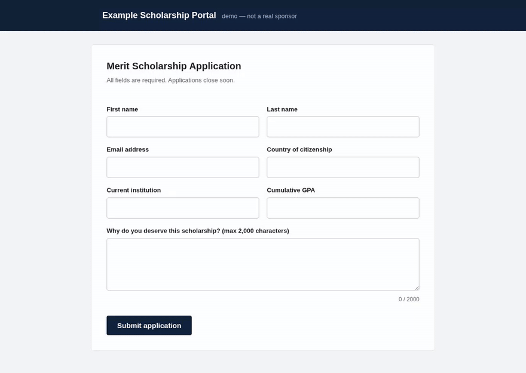
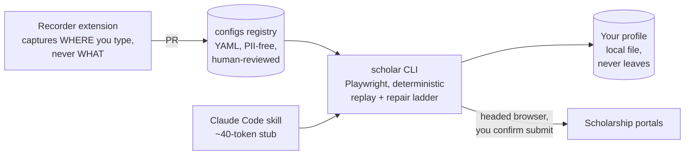

<div align="center">

# 🎓 ScholarAssist

**It fills. You review. You submit.**

A config-driven scholarship application assistant. One local profile, community-shareable per-site configs, a real visible browser — and a human hand on every submit button.

[](https://github.com/EhsanulHaqueSiam/ScholarAssist/actions/workflows/ci.yml)
[](LICENSE)
[](package.json)
[](https://playwright.dev)

[Why](#why) · [How it works](#how-it-works) · [Quickstart](#quickstart) · [Configs](#site-configs) · [Safety](#what-it-refuses-to-do) · [Roadmap](#roadmap)



*The engine fills every field from your local profile, then stops. The submit belongs to you.*

</div>

---

## Why

Applying to scholarships means retyping the same 40 fields into 12 incompatible portals, tracking deadlines across 12 timezones, and adapting one honest essay to 12 word limits. The tools that promised to fix this either died ([Going Merry](https://www.earnest.com/blog/going-merry-closing-faqs), shut down 2026), sold student data ([Scholly](https://techcrunch.com/2026/04/28/founder-of-shark-tank-backed-startup-scholly-sues-his-acquirer-sallie-mae/), now in court), or blast sweepstakes entries that get students disqualified.

ScholarAssist takes the opposite bet: **help a student apply to 12 well-matched scholarships excellently instead of 300 badly.**

- **Local-first.** Your profile is a file on your machine. No server, no telemetry, no account, nothing to sell.
- **Config-driven.** Each site's structure (selectors, field mappings, flow) lives in a shareable YAML file that is **PII-free by construction** — configs name profile keys, never values. Fill a form once; everyone after you replays it.
- **Token-efficient.** Deterministic replay costs zero LLM tokens on the happy path. The model is only consulted when a site drifts — and its repair proposal is verified and reviewed before it touches any config.
- **Honest.** It never writes your essays, never guesses a value, never bypasses a CAPTCHA, and never submits anything without showing you every field and waiting for you to type `submit`.

## How it works



Every locator resolves through a **cost ladder** — each rung more expensive than the last, most runs never leaving rung 0:

| Rung | Mechanism | LLM cost |
|:---:|---|---|
| 0 | primary semantic locator (`role` + accessible name, label) | none |
| 1 | ranked fallback locators | none |
| 2 | repair: a11y snapshot → your own `claude` CLI proposes a locator → verified → saved as a **patch proposal**, never a silent edit | one small call |
| 🧑 | CAPTCHA, 2FA, review gate, anything unresolved → the visible browser is yours | you |

## Quickstart

```sh
pnpm install
pnpm dev start                 # guided: installs the browser, asks your basics
                               # inline, then shows a demo fill (fictional data)

pnpm dev docs add ~/cv.pdf --as cv           # register documents once; uploads find them
pnpm dev profile import https://your.site    # propose values from your own page — you
                                             # confirm each one before it saves
pnpm dev run                                 # no args: pick a portal from a list

pnpm dev run chevening --flow apply              # step mode: confirm each page
pnpm dev run <site> --flow apply --mode auto     # auto-advance pages — submit still asks
pnpm dev run <site> --flow apply --dry-run       # fill + review table, never submits
pnpm dev doctor                                  # env check when something's off
```

Every run **pre-flights** its needs on one screen: fields the site wants, ✓/✗
against your profile, and an inline interview for whatever's missing — typed
once, saved to your profile, never asked again. No YAML editing, no hopping
between a run that died and an editor.

Everything personal lives in one folder, one shape (`~/.config/scholar/`):

```
profile.yaml   what gets TYPED into forms (canonical keys; runs fill only from here)
docs/          what gets UPLOADED — `scholar docs add cv.pdf --as cv` binds documents.cv
cv/            CV sources + per-program format specs (1-page/no-photo/Europass rules vary!)
essays/        long-form essay masters; the fitted, per-portal version goes into essay.* keys
```

An agent may draft `profile.yaml` from your public portfolio (`scholar profile
import <url>`, or ask your agent) — always as a reviewable draft with TODOs;
portals are never filled from anything you haven't confirmed.

Every run writes proof to `~/.local/state/scholar/runs/<timestamp>/`: per-page screenshots, an append-only `audit.jsonl` recording **where every value came from**, and on submit a confirmation screenshot + URL — your receipt if a sponsor ever disputes it.

### Track your deadlines

```sh
scholar track add chevening --award "Chevening 2027/28" \
  --deadline "6 Oct 2026 11:00 UTC"
scholar track list             # sorted by time-left, DST-proof
scholar track set <id> blocked_on_human --notes "waiting on recommender"
```

Deadlines are refused without an explicit UTC offset (a naive deadline is a missed deadline), and duplicate site + award + cycle entries are refused (duplicates get applications disqualified). See [`UPCOMING-SCHOLARSHIPS.md`](UPCOMING-SCHOLARSHIPS.md) for the researched 2027-intake calendar for Bangladeshi students, and [`APPLICATION-REQUIREMENTS.md`](APPLICATION-REQUIREMENTS.md) for each portal's document lists, referee deadlines, and disqualifying gotchas.

## Site configs

A config is declarative YAML — a closed step vocabulary, no code, no values:

```yaml
fields:
  applicant.email:
    locator:
      primary: { css: "#email" }          # Slate standard
      fallbacks: [{ label: "Email" }]
    autocomplete: email

flows:
  register:
    pages:
      - id: register
        steps:
          - { action: navigate, url: "https://apply.example.org/account/register" }
          - { action: fill_fields, fields: [applicant.email, applicant.given_name] }
        advance:
          target: { primary: { role: button, name: "Continue" } }
          submit: true        # ← the runtime ALWAYS stops here for a human
```

`scholar lint` enforces purity: literal values fail, PII patterns fail, navigation outside the declared origins fails. What can't carry data can't leak it.

**Three ways to create one:**

1. `scholar config record <url>` — apply once by hand in the opened browser; it captures *where* you typed (selector bundles + label evidence), never *what*, then proposes profile-key bindings for you to confirm.
2. The [browser extension](extension/) (load unpacked) — same invariant, with inline binding review and YAML export.
3. `scholar config import-recording rec.json` — convert a Chrome DevTools Recorder export (typed values are discarded on import).

When a site redesigns, runs self-heal through the ladder and propose patches: `scholar config promote <runDir> --config <file>`, then `scholar config verify` reports rung drift. Contribution rules: [`configs/CONTRIBUTING.md`](configs/CONTRIBUTING.md).

## What it refuses to do

These are invariants in code, not settings:

| | Never | Because |
|---|---|---|
| 🚫 | Auto-submit | The review gate shows every field, value, and attachment and waits for you to type `submit` — in every mode, no flag disables it |
| 🚫 | Bypass CAPTCHA / 2FA / bot checks | The browser is headed and yours; challenges are handed to you. Sites that block a visible human-supervised browser are marked unsupported |
| 🚫 | Write essays or invent values | Every value traces to your profile; a missing key blocks and asks. AI-written applications get students disqualified |
| 🚫 | Touch SSN, banking, FSA ID, FAFSA | No schema field exists; a page requesting one halts with a scam warning ([FTC guidance](https://consumer.ftc.gov/articles/how-avoid-scholarship-and-financial-aid-scams)) |
| 🚫 | Act as a recommender or third party | Recommendation letters are tracked as blocking human tasks, never filled |
| 🚫 | Phone home | No server, no telemetry, no cloud sync |

## Claude Code skill

```sh
scholar skills get core        # the full agent guide ships in the binary
ln -s "$PWD/skills/scholar" ~/.claude/skills/scholar
```

The `SKILL.md` on disk is a ~40-token discovery stub; the real, version-matched guide is served by the binary so instructions can never drift from the commands that run.

## Development

```sh
pnpm test          # config lint + headless end-to-end against a local fixture form
pnpm typecheck
node scripts/build-site.mjs    # generates site/index.html from configs/
```

## Roadmap

- [x] Deterministic replay (rungs 0–1), review gate, audit artifacts
- [x] LLM repair (rung 2) with propose → verify → promote
- [x] Recorder (in-browser + DevTools import) and MV3 extension
- [x] Tracker with timezone-safe deadlines and cycle-aware dedupe
- [x] 12 live-captured portal configs (4× Slate, DreamApply, Evalato, ASAMS, CSC Central, TBBS, …)
- [ ] Registry repo split with signed releases (cosign) and two-tier merge
- [ ] Nightly read-only drift CI against live portals (freshness badges)
- [ ] Post-login apply flows recorded for the flagship portals
- [ ] Vision rung (4) if real failure logs justify it

The full research-backed plan — market graveyard, WRITE-task benchmarks, per-site ToS analysis, ecosystem precedents — lives in [`PLAN.md`](PLAN.md).

## License

[MIT](LICENSE). Configs are contributed under CC0.
